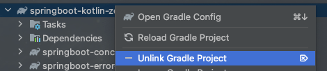
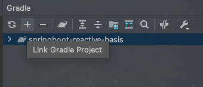

# springboot-kotlin-zerotoall

## multi module project
* 단일버전 같이 공유
```
springboot-kotlin-zerotoall
    |
    |-- springboot-concurrency-basis
    |-- springboot-error-basis
    |-- springboot-gql-basis
    |-- springboot-jpa-basis
    |-- springboot-mongo-basis
    |-- springboot-pageable-basis
    |-- springboot-redis-basis
    |-- springboot-swagger-basis
    |-- springboot-testcode-basis
    |-- springboot-testcontainer-basis
```

## single module project
```
springboot-kotlin-zerotoall
    |
    |-- springboot-query-perf-basis 
    |
    |-- springboot-reactive-basis
```
### 참고
> 싱글 모듈 프로젝트는 build.gradle.kts 깨진다.
> *  intellij 기준, 해당 프로젝트 gradle 외에 springboot-kotlin-zerotoall 우클릭. 
> * `unlink gradle project` 클릭
> 
> 
> 
> unlink 된 project 를 불러오고 싶다면, gradle 탭에서 `+` 버튼을 눌러 해당 프로젝트를 링크를 건다.
> 
> 