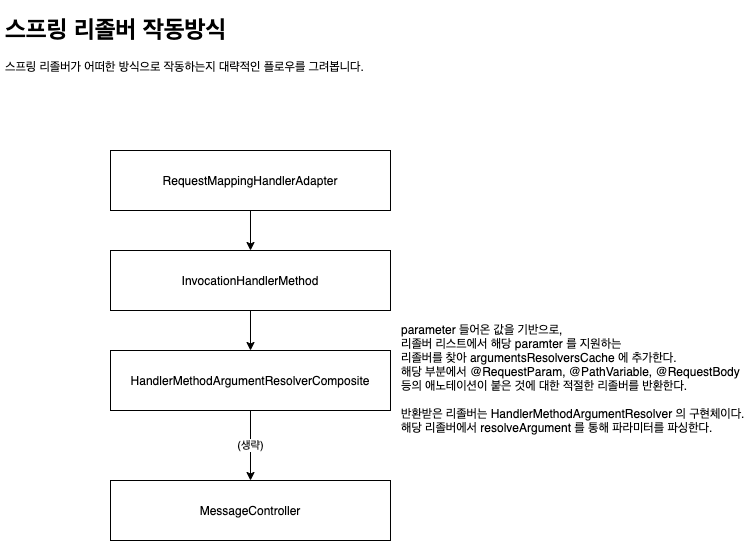

# 에러원인
에러는 @RequestBody 를 붙이게 됨으로써, 리졸버가 추가가 되는데 해당 리졸버에서 헤더를 검사한다.   
헤더 검사 시, content-type 이 application/json 이 없었고 그에 따라 지원하지 않는 디폴트 헤더 값이 있어서 에러가 났다.   
결과적으로 api 를 호출하는 곳에서 헤더에 application/json 을 붙여줌으로써 문제를 해결할 수 있었다.

# 스프링 리졸버 작동방식


## HandlerMethodArgumentResolverComposite : code
parameter 에 대한 알맞은 리졸버를 cache 에서 찾고, 없으면
리졸버 목록을 순회하면서 파라미터를 지원하는 리졸버를 찾아 cache 에 적재하고 반환한다.
```java
/**
 * Find a registered {@link HandlerMethodArgumentResolver} that supports
 * the given method parameter.
 */
@Nullable
private HandlerMethodArgumentResolver getArgumentResolver(MethodParameter parameter) {
    HandlerMethodArgumentResolver result = this.argumentResolverCache.get(parameter);
    if (result == null) {
        for (HandlerMethodArgumentResolver resolver : this.argumentResolvers) {
            if (resolver.supportsParameter(parameter)) {
                result = resolver;
                this.argumentResolverCache.put(parameter, result);
                break;
            }
        }
    }
    return result;
}
```
